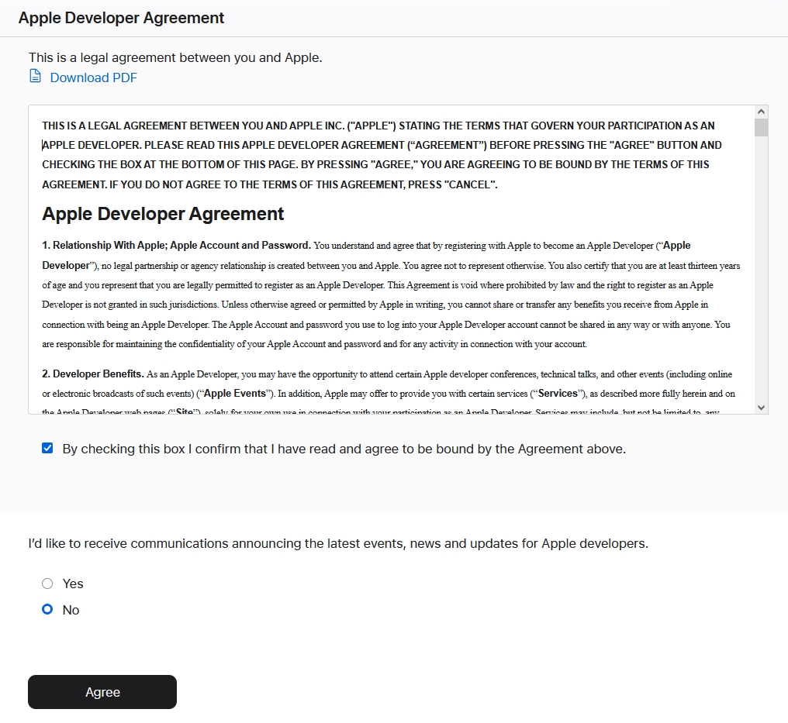
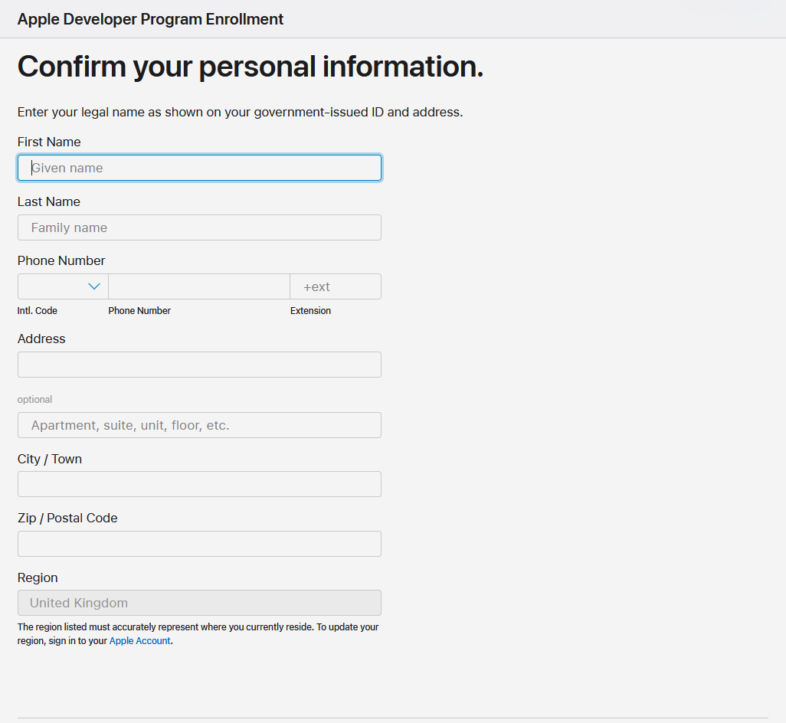
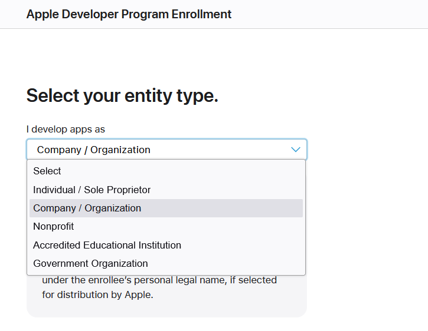
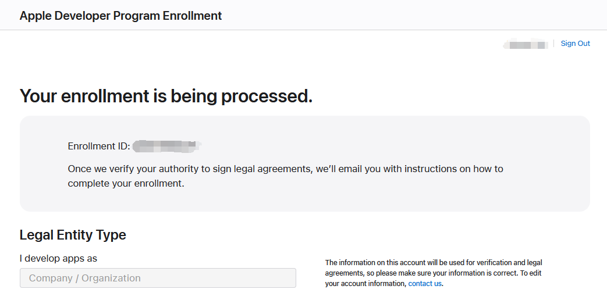

+++
title = '苹果开发者账号注册教程'
slug = 'Apple Developer Register'
date = '2025-03-19T15:05:01+08:00'
draft = false
categories = [""]
tags = ["apple"]
image = "https://developer.apple.com/news/images/og/apple-developer-og-twitter.png"

+++

## 准备材料

- 一个英国的 Apple ID
- 一个英国手机号，比如 Giffgaff。
- 如果是公司注册则还需要英国公司和 DUNS Number。

## 开始注册

注册地址：[Apple Developer](https://developer.apple.com/) | [Apple Developer 中文](https://developer.apple.com/cn/)

登录英国 Apple ID 账号。

同意。

填写个人信息

根据自己的情况选择，我这里用公司。

填写完资料后提交就会看到如图所示：

静静等待。

