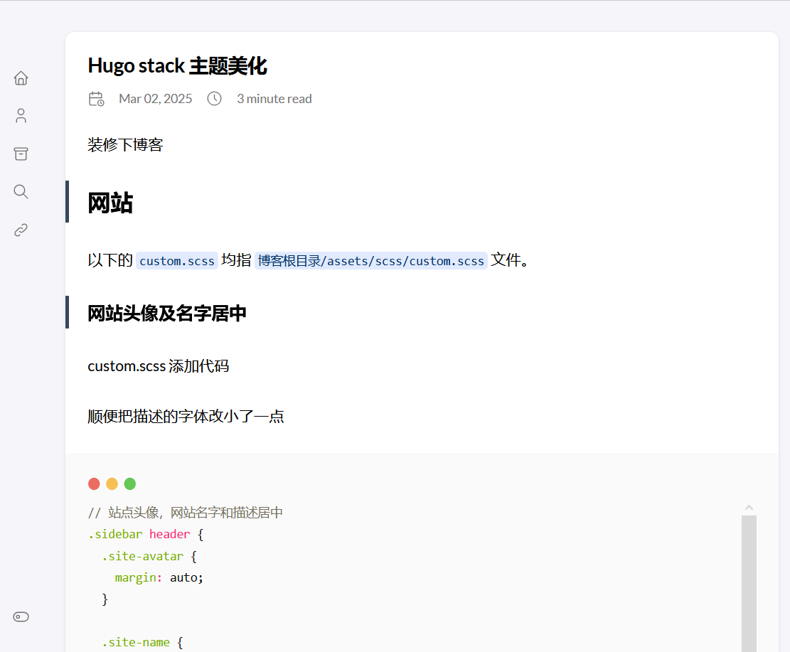

装修下博客

## 网站

以下的 `custom.scss` 均指  `博客根目录/assets/scss/custom.scss` 文件。

### 网站头像及名字居中

`custom.scss` 添加代码

顺便把描述的字体改小了一点

```scss
// 站点头像，网站名字和描述居中
.sidebar header {
  .site-avatar {
    margin: auto;
  }

  .site-name {
    margin: auto;
  }

  .site-description {
    margin: auto;
    font-size: 1.3rem;
    @include respond(2xl) {
      font-size: 1.6rem;
    }
  }
}
// 社交图标居中
.menu-social {
  margin: auto;
}
```


### 滚动条优化

`custom.scss` 添加代码

```scss
/* 全局滚动条样式 */
* {
  scrollbar-width: thin; /* auto | thin | none */
  scrollbar-color: rgba(0, 0, 0, 0.3) transparent; /* 半透明黑色滑块，透明轨道 */
}
```


### 归档页面

**分类列表优化，卡片缩放动画**

改小了一点，原先的太大了

custom.scss 添加代码

```scss
// 归档页面 分类列表优化
.subsection-list {
    .article-list--tile {
        display: flex;
        padding-bottom: 15px;

        article {
            width: 200px;
            height: 120px;
            margin-right: 10px;

            .article-title {
                margin: 0;
                font-size: 1.8rem;
            }
      }
    }
}

// 归档页面卡片缩放动画
.article-list--tile article {
  transition: .6s ease;
}
.article-list--tile article:hover {
  transform: scale(1.03, 1.03);
}
```

**归档页面两栏**

```scss
// 归档页面两栏
@media (min-width: 1024px) {
  .article-list--compact {
    display: grid;
    grid-template-columns: 1fr 1fr;
    background: none;
    box-shadow: none;
    gap: 1rem;

    article {
      background: var(--card-background);
      border: none;
      box-shadow: var(--shadow-l2);
      margin-bottom: 8px;
      border-radius: 16px;
    }
  }
}
```

#### 归档页面显示文章副标题/简介

`custom.scss` 添加代码

```scss
.article-subtitle {
    margin-top: -5px;
    font-size: 1.5rem;

    @include respond(md) {
        font-size: 1.6rem;
    }
}
```

`主题根目录/layouts/partials/article-list/compact.html` 开头 h2 下方添加代码

```html
<h2 class="article-title">
    {{- .Title -}}
</h2>
{{ with .Params.description }}
    <div class="article-subtitle">
        {{ . }}
    </div>
{{ end }}
```

### 左侧导航栏主菜单优化

左侧导航栏主菜单间距，移动端弹出菜单优化，图标与链接的间距优化。

`custom.scss` 添加代码，根据自己需求修改 gap

```scss
#main-menu {
  // 左侧导航栏主菜单上下间距
  margin: auto;
  &, .menu-bottom-section ol {
      flex-direction: column;
      gap: 20px;

      @include respond(xl) {
        gap: 20px;
      }
  }

  // 移动端弹出菜单优化
  &.show {
    display: flex;
    position: absolute;
    top: 20%;
    right: 1%;
    z-index: 10;
    width: auto;
    max-width: 250px;
    border-radius: var(--card-border-radius);
  }
}

// 左侧导航栏主菜单内图标与链接的间距
:root {
  --menu-icon-separation: 20px;

  // section 间距
  --section-separation: 30px;
  --widget-separation: var(--section-separation);
}
```

### 添加移动端目录

电脑端保持原来的目录，移动端添加一个按钮可以打开目录。

添加文件 `layouts/partials/widget/toc.html`

```html
{{ if (.Context.Scratch.Get "TOCEnabled") }}
    <!-- 移动端目录按钮 -->
    <button id="toggle-toc" class="mobile-only">Toc</button>
    <section class="widget archives" id="toc-container">
        <div class="widget-icon">
            {{ partial "helper/icon" "hash" }}
        </div>
        <h2 class="widget-title section-title">{{ T "article.tableOfContents" }}</h2>

        <div class="widget--toc">
            {{ .Context.TableOfContents }}
        </div>
    </section>
{{ end }}

<style>
    .container {
        .right-sidebar {
            /* flex 布局显示移动端目录按钮 */
            display: flex;
        }
    }

    /* 默认隐藏移动端目录元素，电脑端将覆盖显示 */
    .mobile-only {
        display: none !important;
    }

    #toc-container {
        /* 初始时不再隐藏目录，电脑端默认显示，移动端会被覆盖隐藏 */
        /* display: none;  */
        position: fixed;
        /* 使用固定定位，使其固定在视口中 */
        bottom: 21%;
        /* 距离视口顶部的距离 */
        right: 60px;
        /* 距离视口右侧的距离 */
        background-color: var(--card-background);
        /* 可选：设置背景颜色 */
        padding: 10px;
        /* 可选：添加一些内边距 */
        border: 1px solid #96979a50;
        border-radius: var(--card-border-radius);
        /* 可选：添加边框样式 */
        box-shadow: rgba(14, 30, 37, 0.12) 0px 2px 4px 0px, rgba(14, 30, 37, 0.32) 0px 2px 16px 0px;
        /* 可选：设置 z-index 以确保它显示在其他元素之上 */
        z-index: 9998 !important;
        /* 设置最大高度为视口高度的 75% */
        max-height: 75vh;
        overflow-y: auto;
        /* 让容器的宽度自适应内容 */
        width: auto;
        max-width: 290px;
    }

    #toggle-toc {
        position: fixed;
        bottom: 22%;
        right: 20px;
        padding: 10px 10px;
        z-index: 9998 !important;
        border: 0px solid #96979a50;
        border-radius: 7px;
        box-shadow: var(--shadow-l1);
        background-color: #00640010;
        color: #34495e;
        /* 确保按钮在其他元素之上 */
        display: none; /* 初始时在电脑端也隐藏按钮，移动端通过媒体查询显示 */
        margin-bottom: -20px;
        cursor: pointer;
        font-size: 1.2rem;
    }

    .widget--toc #TableOfContents {
        overflow-x: auto;
        max-height: 66vh;
        width: auto;
    }

    @media screen and (max-width: 768px) {
        .mobile-only {
            display: block !important; /* 移动端显示 'Toc' 按钮 */
        }

        #toc-container {
            display: none; /* 移动端依旧隐藏目录容器，通过按钮显示 */
        }

        #toggle-toc {
            display: block; /* 移动端显示 toggle 按钮 */
            bottom: 100px; /* 移动端按钮位置调整 */
        }
    }

    /* 电脑端样式：屏幕宽度大于 768px 时应用 */
    @media screen and (min-width: 769px) {
        #toc-container {
            display: block !important; /* 电脑端默认显示目录容器 */
            position: static; /* 移除固定定位，让目录在正常文档流中 */
            border: none; /* 移除边框 */
            box-shadow: none; /* 移除阴影 */
            max-height: none; /* 移除最大高度限制 */
            overflow-y: visible; /* 移除垂直滚动条 */
            margin-top: 20px; /* 可以根据需要添加一些顶部外边距，与页面内容区隔开 */
            right: auto; /* 重置 right 属性 */
            bottom: auto; /* 重置 bottom 属性 */
            width: auto; /* 宽度自适应内容 */
            max-width: 100%; /* 最大宽度可以设置为 100% 或您需要的宽度 */
            background-color: transparent; /* 背景色透明，或者设置为您想要的颜色 */
            padding: 0; /* 移除内边距 */
        }

        #toggle-toc {
            display: none !important; /* 电脑端隐藏 'Toc' 按钮 */
        }
    }
</style>
<script>
    var toggleButton = document.getElementById('toggle-toc');
    var tocContainer = document.getElementById('toc-container');

    // 添加点击事件：切换目录的显示状态
    toggleButton.addEventListener('click', function() {
        if (tocContainer.style.display === 'none' || tocContainer.style.display === '') {
            tocContainer.style.display = 'block';
        } else {
            tocContainer.style.display = 'none';
        }
    });

    // 当鼠标悬浮在按钮上时显示目录
    toggleButton.addEventListener('mouseover', function() {
        // if (window.innerWidth <= 768) { // 仅在移动端悬浮显示
            tocContainer.style.display = 'block';
        // }
    });

    // 添加点击页面空白处的事件处理程序
    document.addEventListener('click', function(event) {
        // if (window.innerWidth <= 768) { // 仅在移动端点击空白处隐藏
            // 检查点击事件是否发生在目录容器之外，并且不是按钮本身
            if (!tocContainer.contains(event.target) && event.target !== toggleButton) {
                // 点击发生在目录容器之外，隐藏目录容器
                tocContainer.style.display = 'none';
            }
        // }
    });
</script>
```

if 那块代码是原来主题根目录下此文件的代码，添加的代码：添加移动端目录按钮，section 添加 id，添加 style 和 script 的代码。

代码参考自：[yelleis](https://yelleis.top/p/hugo-theme-stack-beautification-2/#%E7%9B%AE%E5%BD%95%E6%8C%89%E9%92%AE)，我做了些改动和优化，因为刚开始我直接复制代码进去在移动端是看不见的，最后反复查看才知道是flex的原因。

### 代码块优化

添加 macOS 样式，固定高度，边框优化，代码块内字体调小

`custom.scss` 添加代码：

```scss
.article-content {
  // 为代码块顶部添加 macOS 样式
  .highlight:before {
    content: '';
    display: block;
    background: url(/code-header.svg);
    height: 24px;
    width: 100%;
    background-size: 57px;
    background-repeat: no-repeat;
    margin-bottom: 5px;
    background-position: -1px 2px;
  }

  // 代码块边框样式
  .highlight {
    max-width: 100% !important;
    margin: 0 auto;
    border-radius: 20px;
    box-shadow: var(--shadow-l1) !important;
    ::-webkit-scrollbar-corner {
      background-color: transparent;
    }
  }
}

// 缩小代码块的字体大小
code {
  // border-radius: var(--tag-border-radius);
  font-size: 14px;
  // font-family: var(--code-font-family);
}
```

### 主页右侧导航栏去除归档和分类

`hugo.yaml` 配置

```yaml
    widgets:
        homepage:
            - type: search
            # - type: archives
            #   params:
            #       limit: 5
            # - type: categories
            #   params:
            #       limit: 10
            - type: tag-cloud
              params:
                  limit: 10
        page:
            - type: toc
```

### 添加上一篇下一篇文章

`主题根目录/layouts/_default/single.html`

在 {{ partial "article/components/related-content" . }} 下方添加代码

```html
    <div class="pre-next">
        {{with .PrevInSection}}
            <a class="pre-next-btn bg" href="{{.Permalink}}"><< {{ .Title }}</a>
        {{end}}
        {{with .NextInSection}}
            <a class="pre-next-btn bg" href="{{.Permalink}}">{{ .Title }} >></a>
        {{end}}
    </div>
```

`custom.scss`添加样式

```scss
// 上一篇下一篇的样式
.pre-next {
  display: flex;
  text-align: center;
  justify-content: space-between;
  align-items: center;
  margin: 20px 0;
}
.pre-next-btn {
  font-size: 1.4rem;
  padding: 8px 18px;
  border-radius: 20px;
  text-decoration: none;
  display: inline-block;
}
@media (max-width: 768px) {
  .pre-next {
    flex-direction: column;
    align-items: center;
  }
  .pre-next-btn {
    font-size: 3.5vw;
    padding: 12px 25px;
    margin: 10px 0;
  }
}
```

### 博客文章下缩小左导航栏

当在阅读文章页面时，我觉得左侧导航栏有点不好看，希望能沉浸式阅读，于是有了下面的修改。

具体修改：电脑端时且在阅读博客文章时，不显示头像，描述和社交链接，以及左导航栏的文字内容。移动端需要显示，所以这就涉及到结合 css 媒体查询进行条件渲染了。

效果：



添加文件 `/layouts/partials/sidebar/left.html`

先将主题根目录的此文件复制过来，我们在此基础修改，很简单。

顶行添加变量定义：

```html
{ $isBlogPost := eq .Section "post" }}
```

我们用这个判断当前页面是不是处于 post 下，这里根据你自己的主题可能需要修改具体的值，因为 stack 主题博文都是保存在 `/content/post` 下，所以这里写的是post，根据你自己的情况调整。

最后一行添加如下代码：

```html
<style>
    /* 默认状态：始终显示 */
    .hidden-post {
        display: block;
    }

    /* 判断isBlogPost为真且是非移动端时隐藏 */
    @media (min-width: 768px) {
        {{ if $isBlogPost }}
        .hidden-post {
            display: none;
        }
        {{ end }}
    }

    /* 在移动端（max-width: 767px）时，强制显示 */
    @media (max-width: 767px) {
        .hidden-post {
            display: block !important;
        }
    }
</style>
```

我们用 hidden-post 来控制是否隐藏，现在只需要在我们希望的元素上添加上这个 class 即可。

最终的完整代码：

```html
{{ $isBlogPost := eq .Section "post" }}

<aside class="sidebar left-sidebar sticky {{ if .Site.Params.sidebar.compact }}compact{{ end }}">
    <button class="hamburger hamburger--spin" type="button" id="toggle-menu" aria-label="{{ T `toggleMenu` }}">
        <span class="hamburger-box">
            <span class="hamburger-inner"></span>
        </span>
    </button>
    
    <header>
        {{ with .Site.Params.sidebar.avatar }}
            {{ if (default true .enabled) }}
                <figure class="site-avatar hidden-post">
                    <a href="{{ .Site.BaseURL | relLangURL }}">
                        {{ if not .local }}
                            
                        {{ else }}
                            {{ $avatar := resources.Get (.src) }}
                            
                            {{ if $avatar }}
                                {{ $avatarResized := $avatar.Resize "300x" }}
                                
                            {{ else }}
                                {{ errorf "Failed loading avatar from %q" . }}
                            {{ end }}
                        {{ end }}
                    </a>
                    {{ with $.Site.Params.sidebar.emoji }}
                        <span class="emoji">{{ . }}</span>
                    {{ end }}
                </figure>
            {{ end }}
        {{ end }}

        <div class="site-meta">
            <h1 class="site-name hidden-post"><a href="{{ .Site.BaseURL | relLangURL }}">{{ .Site.Title }}</a></h1>
            <h2 class="site-description hidden-post">{{ .Site.Params.sidebar.subtitle }}</h2>
        </div>
    </header>

    {{ with .Site.Menus.social -}}
        <ol class="menu-social">
            {{ range . }}
                <li class="hidden-post">
                    <a 
                        href='{{ .URL }}'
                        {{ if eq (default true .Params.newTab) true }}target="_blank"{{ end }}
                        {{ with .Name }}title="{{ . }}"{{ end }}
                        rel="me"
                    >
                        {{ $icon := default "link" .Params.Icon }}
                        {{ with $icon }}
                            {{ partial "helper/icon" . }}
                        {{ end }}
                    </a>
                </li>
            {{ end }}
        </ol>
    {{- end -}}

    <ol class="menu" id="main-menu">
        {{ if $isBlogPost }}
            <li class="" id="back-button"> 
                <a href="javascript:history.back();" title="Go back">
                    {{ partial "helper/icon" "arrow-left" }}
                </a>
            </li>
        {{ end }}
        {{ $currentPage := . }}
        {{ range .Site.Menus.main }}
        {{ $active := or (eq $currentPage.Title .Name) (or ($currentPage.HasMenuCurrent "main" .) ($currentPage.IsMenuCurrent "main" .)) }}
        <li {{ if $active }} class='current' {{ end }}>
            <a href='{{ .URL }}' {{ if eq .Params.newTab true }}target="_blank"{{ end }}>
                {{ $icon := default .Pre .Params.Icon }}
                {{ if .Pre }}
                    {{ warnf "Menu item [%s] is using [pre] field to set icon, please use [params.icon] instead.\nMore information: https://stack.jimmycai.com/config/menu" .URL }}
                {{ end }}
                {{ with $icon }}
                    {{ partial "helper/icon" . }}
                {{ end }}
                    <span class="hidden-post">{{- .Name -}}</span>
            </a>
        </li>
        {{ end }}
        <li class="menu-bottom-section">
            <ol class="menu">
                {{- $currentLanguageCode := .Language.Lang -}}
                {{ if ( compare.Gt .Site.Home.AllTranslations.Len 1 ) }}
                    {{ with .Site.Home.AllTranslations }}
                        <li id="i18n-switch">  
                            {{ partial "helper/icon" "language" }}
                            <select name="language" title="language" onchange="window.location.href = this.selectedOptions[0].value">
                                {{ range . }}
                                    <option value="{{ .Permalink }}" {{ if eq .Language.Lang $currentLanguageCode }}selected{{ end }}>{{ .Language.LanguageName }}</option>
                                {{ end }}
                            </select>
                        </li>
                    {{ end }}
                {{ end }}

                {{ if (default false .Site.Params.colorScheme.toggle) }}
                    <li id="dark-mode-toggle">
                        {{ partial "helper/icon" "toggle-left" }}
                        {{ partial "helper/icon" "toggle-right" }}
                        <span class="hidden-post">{{ T "darkMode" }}</span>
                    </li>
                {{ end }}
            </ol>
        </li>
    </ol>
</aside>

<style>
    /* 默认状态：始终显示 */
    .hidden-post {
        display: block;
    }

    /* 判断isBlogPost为真且是非移动端时隐藏 */
    @media (min-width: 768px) {
        {{ if $isBlogPost }}
        .hidden-post {
            display: none;
        }
        {{ end }}
    }

    /* 在移动端（max-width: 767px）时，强制显示 */
    @media (max-width: 767px) {
        .hidden-post {
            display: block !important;
        }
        #back-button {
            display: none;
        }
    }
</style>

```

如果你在用的编辑器报错，不用管他，这是因为 html 没有 hugo 的模板语法。

添加了一个返回键。

需要添加文件 `assets/icons/arrow-left.svg`

svg 文件在 [tabler](https://tabler.io/icons) 下载。为什么用 tabler，不用其他的呢？因为 stack 主题的图标就用的这个。

### 添加文章社交链接分享

参考自：https://github.com/Stals/hugo-share-buttons?tab=readme-ov-file

我在他的基础上添加了 Link 分享，跟着我来添加吧！

创建`layouts/partials/share-buttons.html`文件

```html
{{/* Made using https://sharingbuttons.io/ */}}
{{ if not .Params.disableShare }}

{{ if (not (isset .Site.Params.ShareButtons "size")) }}
  {{ errorf "'size' should be specified inside shareButtons in hugo config file" }}
{{ end }}

{{ $possibleSizes := (slice "small" "medium" "large") }}
{{ if not (in  $possibleSizes .Site.Params.ShareButtons.Size) }}
  {{ errorf "'size' is %q but should be set to one of possible sizes: %q " .Site.Params.ShareButtons.Size (delimit $possibleSizes ", ") }}
{{ end }}

{{ $supportedNetworks := (slice "link" "facebook" "twitter" "tumblr" "email" "pinterest" "linkedin" "reddit" "xing" "whatsapp" "hackernews" "vk" "telegram")}}

{{ if (not (isset .Site.Params.ShareButtons "networks")) }}
  {{ errorf "'networks' list is not specified inside shareButtons in hugo config file, supported: %q " (delimit $supportedNetworks ", ") }}
{{ end }}

{{ range $network := .Site.Params.ShareButtons.Networks }}
  {{ if not (in $supportedNetworks $network) }}
    {{ errorf "%q is not a supported network, please only provide one of supported: %q " $network (delimit $supportedNetworks ", ") }}
  {{ end }}
{{ end }}


{{ $linkPrefix := "" }}
{{ if eq .Site.Params.ShareButtons.Size "large" }}
  {{ $linkPrefix = "Share on " }}
{{ end }}

{{ $icon := "normal" }}
{{ if (isset .Site.Params.ShareButtons "icon" ) }}
  {{ $icon = .Site.Params.ShareButtons.Icon }}
{{ end }}

{{ $pageURL := .Permalink | safeURL }} {{/*urlquery is undocumented, but maybe should be used here instead*/}}
{{ $pageTitle := .Title | safeHTML }}

{{ $buttonMargin := "0.5em" }}
{{ if (isset .Site.Params.ShareButtons "buttonmargin" ) }}
  {{ $buttonMargin = .Site.Params.ShareButtons.ButtonMargin }}
{{ end }}


<style>
.resp-sharing-button__link,
.resp-sharing-button__icon {
  display: inline-block
}

.resp-sharing-button__link {
  text-decoration: none;
  color: #fff !important;
  margin: {{ $buttonMargin }}
}

.resp-sharing-button {
  border-radius: 5px;
  transition: 25ms ease-out;
  padding: 0.5em 0.75em;
  font-family: Helvetica Neue,Helvetica,Arial,sans-serif;
  {{ if (isset .Site.Params.ShareButtons "fontsize" ) }}
  font-size: {{ .Site.Params.ShareButtons.FontSize }}
  {{ end }}
}

.resp-sharing-button__icon svg {
  width: 1em;
  height: 1em;
  margin-right: 0.4em;
  vertical-align: middle
}

.resp-sharing-button--small svg {
  margin: 0;
  vertical-align: middle
}

/* Non solid icons get a stroke */
.resp-sharing-button__icon {
  stroke: #fff;
  fill: none
}

/* Solid icons get a fill */
.resp-sharing-button__icon--solid,
.resp-sharing-button__icon--solidcircle {
  fill: #fff;
  stroke: none
}

.resp-sharing-button--twitter {
  background-color: #55acee
}

.resp-sharing-button--twitter:hover {
  background-color: #2795e9
}

.resp-sharing-button--pinterest {
  background-color: #bd081c
}

.resp-sharing-button--pinterest:hover {
  background-color: #8c0615
}

.resp-sharing-button--facebook {
  background-color: #3b5998
}

.resp-sharing-button--facebook:hover {
  background-color: #2d4373
}

.resp-sharing-button--tumblr {
  background-color: #35465C
}

.resp-sharing-button--tumblr:hover {
  background-color: #222d3c
}

.resp-sharing-button--reddit {
  background-color: #ff4500
}

.resp-sharing-button--reddit:hover {
  background-color: #3a80c1
}

.resp-sharing-button--google {
  background-color: #dd4b39
}

.resp-sharing-button--google:hover {
  background-color: #c23321
}

.resp-sharing-button--linkedin {
  background-color: #0077b5
}

.resp-sharing-button--linkedin:hover {
  background-color: #046293
}

.resp-sharing-button--email {
  background-color: #777
}

.resp-sharing-button--email:hover {
  background-color: #5e5e5e
}

.resp-sharing-button--xing {
  background-color: #1a7576
}

.resp-sharing-button--xing:hover {
  background-color: #114c4c
}

.resp-sharing-button--whatsapp {
  background-color: #25D366
}

.resp-sharing-button--whatsapp:hover {
  background-color: #1da851
}

.resp-sharing-button--hackernews {
background-color: #FF6600
}
.resp-sharing-button--hackernews:hover, .resp-sharing-button--hackernews:focus {   background-color: #FB6200 }

.resp-sharing-button--vk {
  background-color: #507299
}

.resp-sharing-button--vk:hover {
  background-color: #43648c
}

.resp-sharing-button--facebook {
  background-color: #3b5998;
  border-color: #3b5998;
}

.resp-sharing-button--facebook:hover,
.resp-sharing-button--facebook:active {
  background-color: #2d4373;
  border-color: #2d4373;
}

.resp-sharing-button--twitter {
  background-color: #55acee;
  border-color: #55acee;
}

.resp-sharing-button--twitter:hover,
.resp-sharing-button--twitter:active {
  background-color: #2795e9;
  border-color: #2795e9;
}

.resp-sharing-button--tumblr {
  background-color: #35465C;
  border-color: #35465C;
}

.resp-sharing-button--tumblr:hover,
.resp-sharing-button--tumblr:active {
  background-color: #222d3c;
  border-color: #222d3c;
}

.resp-sharing-button--email {
  background-color: #777777;
  border-color: #777777;
}

.resp-sharing-button--email:hover,
.resp-sharing-button--email:active {
  background-color: #5e5e5e;
  border-color: #5e5e5e;
}

.resp-sharing-button--pinterest {
  background-color: #bd081c;
  border-color: #bd081c;
}

.resp-sharing-button--pinterest:hover,
.resp-sharing-button--pinterest:active {
  background-color: #8c0615;
  border-color: #8c0615;
}

.resp-sharing-button--linkedin {
  background-color: #0077b5;
  border-color: #0077b5;
}

.resp-sharing-button--linkedin:hover,
.resp-sharing-button--linkedin:active {
  background-color: #046293;
  border-color: #046293;
}

.resp-sharing-button--reddit {
  background-color: #ff4500;
  border-color: #ff4500;
}

.resp-sharing-button--reddit:hover,
.resp-sharing-button--reddit:active {
  background-color: #ff5700;
  border-color: #ff5700;
}

.resp-sharing-button--xing {
  background-color: #1a7576;
  border-color: #1a7576;
}

.resp-sharing-button--xing:hover
.resp-sharing-button--xing:active {
  background-color: #114C4C;
  border-color: #114C4C;
}

.resp-sharing-button--whatsapp {
  background-color: #25D366;
  border-color: #25D366;
}

.resp-sharing-button--whatsapp:hover,
.resp-sharing-button--whatsapp:active {
  background-color: #1DA851;
  border-color: #1DA851;
}

.resp-sharing-button--hackernews {
  background-color: #FF6600;
  border-color: #FF6600;
}

.resp-sharing-button--hackernews:hover
.resp-sharing-button--hackernews:active {
  background-color: #FB6200;
  border-color: #FB6200;
}

.resp-sharing-button--vk {
  background-color: #507299;
  border-color: #507299;
}

.resp-sharing-button--vk:hover
.resp-sharing-button--vk:active {
  background-color: #43648c;
  border-color: #43648c;
}

.resp-sharing-button--telegram {
  background-color: #54A9EB;
}

.resp-sharing-button--telegram:hover {
  background-color: #4B97D1;
}
</style>


{{ if in .Site.Params.ShareButtons.Networks "link" }}
<!-- Sharingbutton Link -->
<div class="resp-sharing-button__link" 
     onclick="copyLink(this)" 
     aria-label="{{ T "article.copyLink" }}" 
     title="{{ T "article.copyLink" }}"
     style="cursor: pointer;">
  <div class="resp-sharing-button resp-sharing-button--telegram resp-sharing-button--{{ .Site.Params.ShareButtons.Size }}">
    <div aria-hidden="true" class="resp-sharing-button__icon resp-sharing-button__icon--{{ $icon }}">
      <svg
        xmlns="http://www.w3.org/2000/svg"
        width="20"
        height="20"
        viewBox="0 0 24 24"
        fill="none"
        stroke="white"
        stroke-width="1.5px"
        strokeLinecap="round"
        strokeLinejoin="round"
      >
        <path d="M10 13a5 5 0 0 0 7.54.54l3-3a5 5 0 0 0-7.07-7.07l-1.72 1.71" />
        <path d="M14 11a5 5 0 0 0-7.54-.54l-3 3a5 5 0 0 0 7.07 7.07l1.71-1.71" />
      </svg>
    </div>
    {{if eq .Site.Params.ShareButtons.Size "large"}}Share via {{end}}{{if ne .Site.Params.ShareButtons.Size "small"}}Link{{end}}
    <span class="copy-status" style="display: none; position: absolute; background: #333; color: white; padding: 2px 6px; border-radius: 4px; font-size: 12px; margin-left: 8px;">
      {{ T "article.copied" | default "Link copied" }}
    </span>
  </div>
</div>
{{ end }}

{{ if in .Site.Params.ShareButtons.Networks "facebook" }}
<!-- Sharingbutton Facebook -->
<a class="resp-sharing-button__link" href="https://facebook.com/sharer/sharer.php?u={{ $pageURL }}" target="_blank" rel="noopener" aria-label="" title="Facebook">
  <div class="resp-sharing-button resp-sharing-button--facebook resp-sharing-button--{{ .Site.Params.ShareButtons.Size }}"><div aria-hidden="true" class="resp-sharing-button__icon resp-sharing-button__icon--{{ $icon }}">
{{ if eq $icon "normal" }}<svg xmlns="http://www.w3.org/2000/svg" viewBox="0 0 24 24"><path d="M18.77 7.5H14.5V5.6c0-.9.6-1.1 1-1.1h3V.54L14.17.53C10.24.54 9.5 3.48 9.5 5.37V7.5h-3v4h3v12h5v-12h3.85l.42-4z"/></svg>{{end}}
{{ if eq $icon "solid" }}<svg xmlns="http://www.w3.org/2000/svg" viewBox="0 0 24 24"><path d="M18.77 7.46H14.5v-1.9c0-.9.6-1.1 1-1.1h3V.5h-4.33C10.24.5 9.5 3.44 9.5 5.32v2.15h-3v4h3v12h5v-12h3.85l.42-4z"/></svg>{{end}}
{{ if eq $icon "circle" }}<svg xmlns="http://www.w3.org/2000/svg" viewBox="0 0 24 24"><circle cx="12" cy="12" r="11.5"/><path d="M15.84 9.5H13.5V8.48c0-.53.35-.65.6-.65h1.4v-2.3h-2.35c-2.3 0-2.65 1.7-2.65 2.8V9.5h-2v2h2v7h3v-7h2.1l.24-2z"/></svg>{{ end }}
{{ if eq $icon "solidcircle" }}<svg xmlns="http://www.w3.org/2000/svg" viewBox="0 0 24 24"><path d="M12 0C5.38 0 0 5.38 0 12s5.38 12 12 12 12-5.38 12-12S18.62 0 12 0zm3.6 11.5h-2.1v7h-3v-7h-2v-2h2V8.34c0-1.1.35-2.82 2.65-2.82h2.35v2.3h-1.4c-.25 0-.6.13-.6.66V9.5h2.34l-.24 2z"/></svg>{{ end }}
    </div>{{$linkPrefix}}{{if ne .Site.Params.ShareButtons.Size "small"}}Facebook{{end}}
  </div>
</a>
{{ end }}

{{ if in .Site.Params.ShareButtons.Networks "twitter" }}
<!-- Sharingbutton Twitter -->
<a class="resp-sharing-button__link" href="https://twitter.com/intent/tweet/?text={{ $pageTitle }}&url={{ $pageURL }}" target="_blank" rel="noopener" aria-label="" title="Twitter">
  <div class="resp-sharing-button resp-sharing-button--twitter resp-sharing-button--{{ .Site.Params.ShareButtons.Size }}"><div aria-hidden="true" class="resp-sharing-button__icon resp-sharing-button__icon--{{ $icon }}">
{{ if eq $icon "normal" }}<svg xmlns="http://www.w3.org/2000/svg" viewBox="0 0 24 24"><path d="M23.4 4.83c-.8.37-1.5.38-2.22.02.94-.56.98-.96 1.32-2.02-.88.52-1.85.9-2.9 1.1-.8-.88-2-1.43-3.3-1.43-2.5 0-4.55 2.04-4.55 4.54 0 .36.04.7.12 1.04-3.78-.2-7.12-2-9.37-4.75-.4.67-.6 1.45-.6 2.3 0 1.56.8 2.95 2 3.77-.73-.03-1.43-.23-2.05-.57v.06c0 2.2 1.57 4.03 3.65 4.44-.67.18-1.37.2-2.05.08.57 1.8 2.25 3.12 4.24 3.16-1.95 1.52-4.36 2.16-6.74 1.88 2 1.3 4.4 2.04 6.97 2.04 8.36 0 12.93-6.92 12.93-12.93l-.02-.6c.9-.63 1.96-1.22 2.57-2.14z"/></svg>{{end}}
{{ if eq $icon "solid" }}<svg xmlns="http://www.w3.org/2000/svg" viewBox="0 0 24 24"><path d="M23.44 4.83c-.8.37-1.5.38-2.22.02.93-.56.98-.96 1.32-2.02-.88.52-1.86.9-2.9 1.1-.82-.88-2-1.43-3.3-1.43-2.5 0-4.55 2.04-4.55 4.54 0 .36.03.7.1 1.04-3.77-.2-7.12-2-9.36-4.75-.4.67-.6 1.45-.6 2.3 0 1.56.8 2.95 2 3.77-.74-.03-1.44-.23-2.05-.57v.06c0 2.2 1.56 4.03 3.64 4.44-.67.2-1.37.2-2.06.08.58 1.8 2.26 3.12 4.25 3.16C5.78 18.1 3.37 18.74 1 18.46c2 1.3 4.4 2.04 6.97 2.04 8.35 0 12.92-6.92 12.92-12.93 0-.2 0-.4-.02-.6.9-.63 1.96-1.22 2.56-2.14z"/></svg>{{end}}
{{ if eq $icon "circle" }}<svg xmlns="http://www.w3.org/2000/svg" viewBox="0 0 24 24"><path d="M18.5 7.4l-2 .2c-.4-.5-1-.8-2-.8C13.3 6.8 12 8 12 9.4v.6c-2 0-4-1-5.4-2.7-.2.4-.3.8-.3 1.3 0 1 .4 1.7 1.2 2.2-.5 0-1 0-1.2-.3 0 1.3 1 2.3 2 2.6-.3.4-.7.4-1 0 .2 1.4 1.2 2 2.3 2-1 1-2.5 1.4-4 1 1.3 1 2.7 1.4 4.2 1.4 4.8 0 7.5-4 7.5-7.5v-.4c.5-.4.8-1.5 1.2-2z"/><circle cx="12" cy="12" r="11.5"/></svg>{{ end }}
{{ if eq $icon "solidcircle" }}<svg xmlns="http://www.w3.org/2000/svg" viewBox="0 0 24 24"><path d="M12 0C5.38 0 0 5.38 0 12s5.38 12 12 12 12-5.38 12-12S18.62 0 12 0zm5.26 9.38v.34c0 3.48-2.64 7.5-7.48 7.5-1.48 0-2.87-.44-4.03-1.2 1.37.17 2.77-.2 3.9-1.08-1.16-.02-2.13-.78-2.46-1.83.38.1.8.07 1.17-.03-1.2-.24-2.1-1.3-2.1-2.58v-.05c.35.2.75.32 1.18.33-.7-.47-1.17-1.28-1.17-2.2 0-.47.13-.92.36-1.3C7.94 8.85 9.88 9.9 12.06 10c-.04-.2-.06-.4-.06-.6 0-1.46 1.18-2.63 2.63-2.63.76 0 1.44.3 1.92.82.6-.12 1.95-.27 1.95-.27-.35.53-.72 1.66-1.24 2.04z"/></svg>{{ end }}    
    </div>{{$linkPrefix}}{{if ne .Site.Params.ShareButtons.Size "small"}}Twitter{{end}}
  </div>
</a>
{{ end }}

{{ if in .Site.Params.ShareButtons.Networks "tumblr" }}
<!-- Sharingbutton Tumblr -->
<a class="resp-sharing-button__link" href="https://www.tumblr.com/widgets/share/tool?posttype=link&title={{ $pageTitle }}&caption={{ $pageTitle }}&content={{ $pageURL }}&canonicalUrl={{ $pageURL }}&shareSource=tumblr_share_button" target="_blank" rel="noopener" aria-label="">
  <div class="resp-sharing-button resp-sharing-button--tumblr resp-sharing-button--{{ .Site.Params.ShareButtons.Size }}"><div aria-hidden="true" class="resp-sharing-button__icon resp-sharing-button__icon--{{ $icon }}">
{{ if eq $icon "normal" }}<svg xmlns="http://www.w3.org/2000/svg" viewBox="0 0 24 24"><path d="M13.5.5v5h5v4h-5V15c0 5 3.5 4.4 6 2.8v4.4c-6.7 3.2-12 0-12-4.2V9.5h-3V6.7c1-.3 2.2-.7 3-1.3.5-.5 1-1.2 1.4-2 .3-.7.6-1.7.7-3h3.8z"/></svg>{{end}}
{{ if eq $icon "solid" }}<svg xmlns="http://www.w3.org/2000/svg" viewBox="0 0 24 24"><path d="M13.5.5v5h5v4h-5V15c0 5 3.5 4.4 6 2.8v4.4c-6.7 3.2-12 0-12-4.2V9.5h-3V6.7c1-.3 2.2-.7 3-1.3.5-.5 1-1.2 1.4-2 .3-.7.6-1.7.7-3h3.8z"/></svg>{{end}}
{{ if eq $icon "circle" }}<svg xmlns="http://www.w3.org/2000/svg" viewBox="0 0 24 24"><circle cx="12" cy="12" r="11.5"/><path d="M12.5 4.5v3h2v2h-2v3.72c0 2.47 1.48 2.7 3 1.7v2.7c-4.1 1.92-6-.62-6-3.6V9.5h-2V8.14c.55-.18 1.24-.43 1.63-.77.4-.33.7-.73.94-1.2.24-.46.4-.95.5-1.67h1.93z"/></svg>{{ end }}
{{ if eq $icon "solidcircle" }}<svg version="1.1" x="0px" y="0px" width="24px" height="24px" viewBox="0 0 24 24" enable-background="new 0 0 24 24" xml:space="preserve"><path d="M12,0C5.383,0,0,5.383,0,12s5.383,12,12,12s12-5.383,12-12S18.617,0,12,0z M15.492,17.616C11.401,19.544,9.5,17,9.5,14.031 V9.5h-2V8.142c0.549-0.178,1.236-0.435,1.627-0.768c0.393-0.334,0.707-0.733,0.943-1.2c0.238-0.467,0.401-0.954,0.49-1.675H12.5v3h2 v2h-2v3.719c0,2.468,1.484,2.692,2.992,1.701V17.616z"/></svg>{{ end }}    
    </div>{{$linkPrefix}}{{if ne .Site.Params.ShareButtons.Size "small"}}Tumblr{{end}}
  </div>
</a>
{{ end }}

{{ if in .Site.Params.ShareButtons.Networks "email" }}
<!-- Sharingbutton E-Mail -->
<a class="resp-sharing-button__link" href="mailto:?subject={{ $pageTitle }}&body={{ $pageURL }}" target="_blank" rel="noopener" aria-label="" title="E-Mail">
  <div class="resp-sharing-button resp-sharing-button--email resp-sharing-button--{{ .Site.Params.ShareButtons.Size }}"><div aria-hidden="true" class="resp-sharing-button__icon resp-sharing-button__icon--{{ $icon }}">
{{ if eq $icon "normal" }}<svg xmlns="http://www.w3.org/2000/svg" viewBox="0 0 24 24"><path d="M23.5 18c0 .8-.7 1.5-1.5 1.5H2c-.8 0-1.5-.7-1.5-1.5V6c0-.8.7-1.5 1.5-1.5h20c.8 0 1.5.7 1.5 1.5v12zm-3-9.5L12 14 3.5 8.5m0 7.5L7 14m13.5 2L17 14"/></svg>{{end}}
{{ if eq $icon "solid" }}<svg xmlns="http://www.w3.org/2000/svg" viewBox="0 0 24 24"><path d="M22 4H2C.9 4 0 4.9 0 6v12c0 1.1.9 2 2 2h20c1.1 0 2-.9 2-2V6c0-1.1-.9-2-2-2zM7.25 14.43l-3.5 2c-.08.05-.17.07-.25.07-.17 0-.34-.1-.43-.25-.14-.24-.06-.55.18-.68l3.5-2c.24-.14.55-.06.68.18.14.24.06.55-.18.68zm4.75.07c-.1 0-.2-.03-.27-.08l-8.5-5.5c-.23-.15-.3-.46-.15-.7.15-.22.46-.3.7-.14L12 13.4l8.23-5.32c.23-.15.54-.08.7.15.14.23.07.54-.16.7l-8.5 5.5c-.08.04-.17.07-.27.07zm8.93 1.75c-.1.16-.26.25-.43.25-.08 0-.17-.02-.25-.07l-3.5-2c-.24-.13-.32-.44-.18-.68s.44-.32.68-.18l3.5 2c.24.13.32.44.18.68z"/></svg>{{end}}
{{ if eq $icon "circle" }}<svg xmlns="http://www.w3.org/2000/svg" viewBox="0 0 24 24"><path d="M19.5 16c0 .8-.7 1.5-1.5 1.5H6c-.8 0-1.5-.7-1.5-1.5V8c0-.8.7-1.5 1.5-1.5h12c.8 0 1.5.7 1.5 1.5v8zm-2-7.5L12 13 6.5 8.5m11 6l-4-2.5m-7 2.5l4-2.5"/><circle cx="12" cy="12" r="11.5"/></svg>{{ end }}
{{ if eq $icon "solidcircle" }}<svg xmlns="http://www.w3.org/2000/svg" viewBox="0 0 24 24"><path d="M12 0C5.38 0 0 5.38 0 12s5.38 12 12 12 12-5.38 12-12S18.62 0 12 0zm8 16c0 1.1-.9 2-2 2H6c-1.1 0-2-.9-2-2V8c0-1.1.9-2 2-2h12c1.1 0 2 .9 2 2v8z"/><path d="M17.9 8.18c-.2-.2-.5-.24-.72-.07L12 12.38 6.82 8.1c-.22-.16-.53-.13-.7.08s-.15.53.06.7l3.62 2.97-3.57 2.23c-.23.14-.3.45-.15.7.1.14.25.22.42.22.1 0 .18-.02.27-.08l3.85-2.4 1.06.87c.1.04.2.1.32.1s.23-.06.32-.1l1.06-.9 3.86 2.4c.08.06.17.1.26.1.17 0 .33-.1.42-.25.15-.24.08-.55-.15-.7l-3.57-2.22 3.62-2.96c.2-.2.24-.5.07-.72z"/></svg>{{ end }}    
    </div>{{if eq .Site.Params.ShareButtons.Size "large"}}Share by {{end}}{{if ne .Site.Params.ShareButtons.Size "small"}}E-Mail{{end}}
  </div>
</a>
{{ end }}

{{ if in .Site.Params.ShareButtons.Networks "pinterest" }}
<!-- Sharingbutton Pinterest -->
<a class="resp-sharing-button__link" href="https://pinterest.com/pin/create/button/?url={{ $pageURL }}&media={{ $pageURL }}&description={{ $pageTitle }}" target="_blank" rel="noopener" aria-label="">
  <div class="resp-sharing-button resp-sharing-button--pinterest resp-sharing-button--{{ .Site.Params.ShareButtons.Size }}"><div aria-hidden="true" class="resp-sharing-button__icon resp-sharing-button__icon--{{ $icon }}">
{{ if eq $icon "normal" }}<svg xmlns="http://www.w3.org/2000/svg" viewBox="0 0 24 24"><path d="M12.14.5C5.86.5 2.7 5 2.7 8.75c0 2.27.86 4.3 2.7 5.05.3.12.57 0 .66-.33l.27-1.06c.1-.32.06-.44-.2-.73-.52-.62-.86-1.44-.86-2.6 0-3.33 2.5-6.32 6.5-6.32 3.55 0 5.5 2.17 5.5 5.07 0 3.8-1.7 7.02-4.2 7.02-1.37 0-2.4-1.14-2.07-2.54.4-1.68 1.16-3.48 1.16-4.7 0-1.07-.58-1.98-1.78-1.98-1.4 0-2.55 1.47-2.55 3.42 0 1.25.43 2.1.43 2.1l-1.7 7.2c-.5 2.13-.08 4.75-.04 5 .02.17.22.2.3.1.14-.18 1.82-2.26 2.4-4.33.16-.58.93-3.63.93-3.63.45.88 1.8 1.65 3.22 1.65 4.25 0 7.13-3.87 7.13-9.05C20.5 4.15 17.18.5 12.14.5z"/></svg>{{end}}
{{ if eq $icon "solid" }}<svg xmlns="http://www.w3.org/2000/svg" viewBox="0 0 24 24"><path d="M12.14.5C5.86.5 2.7 5 2.7 8.75c0 2.27.86 4.3 2.7 5.05.3.12.57 0 .66-.33l.27-1.06c.1-.32.06-.44-.2-.73-.52-.62-.86-1.44-.86-2.6 0-3.33 2.5-6.32 6.5-6.32 3.55 0 5.5 2.17 5.5 5.07 0 3.8-1.7 7.02-4.2 7.02-1.37 0-2.4-1.14-2.07-2.54.4-1.68 1.16-3.48 1.16-4.7 0-1.07-.58-1.98-1.78-1.98-1.4 0-2.55 1.47-2.55 3.42 0 1.25.43 2.1.43 2.1l-1.7 7.2c-.5 2.13-.08 4.75-.04 5 .02.17.22.2.3.1.14-.18 1.82-2.26 2.4-4.33.16-.58.93-3.63.93-3.63.45.88 1.8 1.65 3.22 1.65 4.25 0 7.13-3.87 7.13-9.05C20.5 4.15 17.18.5 12.14.5z"/></svg>{{end}}
{{ if eq $icon "circle" }}<svg xmlns="http://www.w3.org/2000/svg" viewBox="0 0 24 24"><circle cx="12" cy="12" r="11.5"/><path d="M8 11.2c-.15-.32-.25-.72-.25-1.22 0-2.32 1.74-4.4 4.53-4.4 2.47 0 3.82 1.5 3.82 3.52 0 2.64-1.17 4.88-2.9 4.88-.97 0-1.7-.8-1.46-1.77.28-1.14.8-2.4.8-3.23 0-.76-.4-1.38-1.23-1.38-.95 0-1.74 1-1.74 2.37 0 .86.3 1.45.3 1.45l-1.2 5c-.34 1.5-.04 3.33-.02 3.5.02.1.16.15.22.06.1-.12 1.26-1.56 1.66-3l.66-2.53c.32.6 1.25 1.14 2.24 1.14 2.95 0 4.95-2.7 4.95-6.3 0-2.73-2.3-5.27-5.82-5.27-4.36 0-6.57 3.14-6.57 5.75 0 .85.18 1.64.53 2.28l1.5-.8z"/></svg>{{ end }}
{{ if eq $icon "solidcircle" }}<svg xmlns="http://www.w3.org/2000/svg" viewBox="0 0 24 24"><path d="M12 0C5.38 0 0 5.38 0 12s5.38 12 12 12 12-5.38 12-12S18.62 0 12 0zm1.4 15.56c-1 0-1.94-.53-2.25-1.14l-.65 2.52c-.4 1.45-1.57 2.9-1.66 3-.06.1-.2.07-.22-.04-.02-.2-.32-2 .03-3.5l1.18-5s-.3-.6-.3-1.46c0-1.36.8-2.37 1.78-2.37.85 0 1.25.62 1.25 1.37 0 .85-.53 2.1-.8 3.27-.24.98.48 1.78 1.44 1.78 1.73 0 2.9-2.24 2.9-4.9 0-2-1.35-3.5-3.82-3.5-2.8 0-4.53 2.07-4.53 4.4 0 .5.1.9.25 1.23l-1.5.82c-.36-.64-.54-1.43-.54-2.28 0-2.6 2.2-5.74 6.57-5.74 3.5 0 5.82 2.54 5.82 5.27 0 3.6-2 6.3-4.96 6.3z"/></svg>{{ end }}    
    </div>{{$linkPrefix}}{{if ne .Site.Params.ShareButtons.Size "small"}}Pinterest{{end}}
  </div>
</a>
{{ end }}

{{ if in .Site.Params.ShareButtons.Networks "linkedin" }}
<!-- Sharingbutton LinkedIn -->
<a class="resp-sharing-button__link" href="https://www.linkedin.com/shareArticle?mini=true&url={{ $pageURL }}&title={{ $pageTitle }}&summary={{ $pageTitle }}&{{ $pageURL }}" target="_blank" rel="noopener" aria-label="">
  <div class="resp-sharing-button resp-sharing-button--linkedin resp-sharing-button--{{ .Site.Params.ShareButtons.Size }}"><div aria-hidden="true" class="resp-sharing-button__icon resp-sharing-button__icon--{{ $icon }}">
{{ if eq $icon "normal" }}<svg xmlns="http://www.w3.org/2000/svg" viewBox="0 0 24 24"><path d="M6.5 21.5h-5v-13h5v13zM4 6.5h-.04c-1.5 0-2.5-1.18-2.5-2.48 0-1.33 1.02-2.4 2.56-2.4s2.5 1.1 2.52 2.43c0 1.3-.98 2.45-2.55 2.45zm11.5 6c-1.1 0-2 .9-2 2v7h-5s.06-12 0-13h5V10s1.55-1.46 3.94-1.46c2.96 0 5.06 2.15 5.06 6.3v6.66h-5v-7c0-1.1-.9-2-2-2z"/></svg>{{end}}
{{ if eq $icon "solid" }}<svg xmlns="http://www.w3.org/2000/svg" viewBox="0 0 24 24"><path d="M6.5 21.5h-5v-13h5v13zM4 6.5C2.5 6.5 1.5 5.3 1.5 4s1-2.4 2.5-2.4c1.6 0 2.5 1 2.6 2.5 0 1.4-1 2.5-2.6 2.5zm11.5 6c-1 0-2 1-2 2v7h-5v-13h5V10s1.6-1.5 4-1.5c3 0 5 2.2 5 6.3v6.7h-5v-7c0-1-1-2-2-2z"/></svg>{{end}}
{{ if eq $icon "circle" }}<svg xmlns="http://www.w3.org/2000/svg" viewBox="0 0 24 24"><circle cx="12" cy="12" r="11.5"/><path d="M15 12.5c-.28 0-.5.22-.5.5v3.5h-3s.03-6.48 0-7h3v.83s.46-.75 1.7-.75c1.56 0 2.3 1.12 2.3 3.3v3.62h-3V13c0-.28-.23-.5-.5-.5zm-7.5-3h2v7h-2z"/><circle cx="8.5" cy="6.5" r="1"/></svg>{{ end }}
{{ if eq $icon "solidcircle" }}<svg version="1.1" x="0px" y="0px" width="24px" height="24px" viewBox="0 0 24 24" enable-background="new 0 0 24 24" xml:space="preserve"><path d="M12,0C5.383,0,0,5.383,0,12s5.383,12,12,12s12-5.383,12-12S18.617,0,12,0z M9.5,16.5h-2v-7h2V16.5z M8.5,7.5 c-0.553,0-1-0.448-1-1c0-0.552,0.447-1,1-1s1,0.448,1,1C9.5,7.052,9.053,7.5,8.5,7.5z M18.5,16.5h-3V13c0-0.277-0.225-0.5-0.5-0.5 c-0.276,0-0.5,0.223-0.5,0.5v3.5h-3c0,0,0.031-6.478,0-7h3v0.835c0,0,0.457-0.753,1.707-0.753c1.55,0,2.293,1.12,2.293,3.296V16.5z" /></svg>{{ end }}    
    </div>{{$linkPrefix}}{{if ne .Site.Params.ShareButtons.Size "small"}}LinkedIn{{end}}
  </div>
</a>
{{ end }}

{{ if in .Site.Params.ShareButtons.Networks "reddit" }}
<!-- Sharingbutton Reddit -->
<a class="resp-sharing-button__link" href="https://reddit.com/submit/?url={{ $pageURL }}&resubmit=true&title={{ $pageTitle }}" target="_blank" rel="noopener" aria-label="" title="Reddit">
  <div class="resp-sharing-button resp-sharing-button--reddit resp-sharing-button--{{ .Site.Params.ShareButtons.Size }}"><div aria-hidden="true" class="resp-sharing-button__icon resp-sharing-button__icon--{{ $icon }}">
{{ if eq $icon "normal" }}<svg xmlns="http://www.w3.org/2000/svg" viewBox="0 0 24 24"><ellipse cx="12" cy="15" rx="9.5" ry="6.5"/><path d="M15.54 17.88c-.96.55-2.2.88-3.54.88-1.35 0-2.6-.33-3.55-.9"/><circle cx="16" cy="13.5" r="1.5"/><circle cx="8" cy="13.5" r="1.5"/><path d="M18.74 10.42C19.14 9.58 20 9 21 9c1.38 0 2.5 1.12 2.5 2.5 0 1.25-.92 2.3-2.12 2.47"/><circle cx="20" cy="4.5" r="2.5"/><path d="M5.26 10.42C4.86 9.58 4 9 3 9 1.62 9 .5 10.12.5 11.5c0 1.25.92 2.3 2.12 2.47M12 8.5s-.13-7.4 5.5-4"/></svg>{{end}}
{{ if eq $icon "solid" }}<svg xmlns="http://www.w3.org/2000/svg" viewBox="0 0 24 24"><path d="M24 11.5c0-1.65-1.35-3-3-3-.96 0-1.86.48-2.42 1.24-1.64-1-3.75-1.64-6.07-1.72.08-1.1.4-3.05 1.52-3.7.72-.4 1.73-.24 3 .5C17.2 6.3 18.46 7.5 20 7.5c1.65 0 3-1.35 3-3s-1.35-3-3-3c-1.38 0-2.54.94-2.88 2.22-1.43-.72-2.64-.8-3.6-.25-1.64.94-1.95 3.47-2 4.55-2.33.08-4.45.7-6.1 1.72C4.86 8.98 3.96 8.5 3 8.5c-1.65 0-3 1.35-3 3 0 1.32.84 2.44 2.05 2.84-.03.22-.05.44-.05.66 0 3.86 4.5 7 10 7s10-3.14 10-7c0-.22-.02-.44-.05-.66 1.2-.4 2.05-1.54 2.05-2.84zM2.3 13.37C1.5 13.07 1 12.35 1 11.5c0-1.1.9-2 2-2 .64 0 1.22.32 1.6.82-1.1.85-1.92 1.9-2.3 3.05zm3.7.13c0-1.1.9-2 2-2s2 .9 2 2-.9 2-2 2-2-.9-2-2zm9.8 4.8c-1.08.63-2.42.96-3.8.96-1.4 0-2.74-.34-3.8-.95-.24-.13-.32-.44-.2-.68.15-.24.46-.32.7-.18 1.83 1.06 4.76 1.06 6.6 0 .23-.13.53-.05.67.2.14.23.06.54-.18.67zm.2-2.8c-1.1 0-2-.9-2-2s.9-2 2-2 2 .9 2 2-.9 2-2 2zm5.7-2.13c-.38-1.16-1.2-2.2-2.3-3.05.38-.5.97-.82 1.6-.82 1.1 0 2 .9 2 2 0 .84-.53 1.57-1.3 1.87z"/></svg>{{end}}
{{ if eq $icon "circle" }}<svg xmlns="http://www.w3.org/2000/svg" viewBox="0 0 24 24"><circle cx="12" cy="12" r="11.5"/><ellipse cx="12" cy="14.37" rx="6.2" ry="4.24"/><path d="M14.3 16.25c-.62.36-1.42.57-2.3.57-.88 0-1.7-.2-2.32-.58"/><circle cx="14.61" cy="13.39" r=".98"/><circle cx="9.39" cy="13.39" r=".98"/><path d="M16.4 11.38c.26-.55.82-.92 1.47-.92.9 0 1.63.73 1.63 1.63 0 .8-.6 1.47-1.38 1.6"/><circle cx="17.22" cy="7.52" r="1.63"/><path d="M7.6 11.38c-.26-.54-.82-.92-1.47-.92-.9 0-1.63.73-1.63 1.63 0 .8.6 1.47 1.38 1.6M12 10.12s-.08-4.82 3.6-2.6"/></svg>{{ end }}
{{ if eq $icon "solidcircle" }}<svg xmlns="http://www.w3.org/2000/svg" viewBox="0 0 24 24"><circle cx="9.391" cy="13.392" r=".978"/><path d="M14.057 15.814c-1.14.66-2.987.655-4.122-.004-.238-.138-.545-.058-.684.182-.13.24-.05.545.19.685.72.417 1.63.646 2.568.646.93 0 1.84-.228 2.558-.642.24-.13.32-.44.185-.68-.14-.24-.445-.32-.683-.18zM5 12.086c0 .41.23.78.568.978.27-.662.735-1.264 1.353-1.774-.2-.207-.48-.334-.79-.334-.62 0-1.13.507-1.13 1.13z"/><path d="M12 0C5.383 0 0 5.383 0 12s5.383 12 12 12 12-5.383 12-12S18.617 0 12 0zm6.673 14.055c.01.104.022.208.022.314 0 2.61-3.004 4.73-6.695 4.73s-6.695-2.126-6.695-4.74c0-.105.013-.21.022-.313C4.537 13.73 4 12.97 4 12.08c0-1.173.956-2.13 2.13-2.13.63 0 1.218.29 1.618.757 1.04-.607 2.345-.99 3.77-1.063.057-.803.308-2.33 1.388-2.95.633-.366 1.417-.323 2.322.085.302-.81 1.076-1.397 1.99-1.397 1.174 0 2.13.96 2.13 2.13 0 1.177-.956 2.133-2.13 2.133-1.065 0-1.942-.79-2.098-1.81-.734-.4-1.315-.506-1.716-.276-.6.346-.818 1.395-.88 2.087 1.407.08 2.697.46 3.728 1.065.4-.468.987-.756 1.617-.756 1.17 0 2.13.953 2.13 2.13 0 .89-.54 1.65-1.33 1.97z"/><circle cx="14.609" cy="13.391" r=".978"/><path d="M17.87 10.956c-.302 0-.583.128-.79.334.616.51 1.082 1.112 1.352 1.774.34-.197.568-.566.568-.978 0-.623-.507-1.13-1.13-1.13z"/></svg>{{ end }}    
    </div>{{$linkPrefix}}{{if ne .Site.Params.ShareButtons.Size "small"}}Reddit{{end}}
  </div>
</a>
{{ end }}

{{ if in .Site.Params.ShareButtons.Networks "xing" }}
<!-- Sharingbutton XING -->
<a class="resp-sharing-button__link" href="https://www.xing.com/app/user?op=share;url={{ $pageURL }};title={{ $pageTitle }}" target="_blank" rel="noopener" aria-label="">
  <div class="resp-sharing-button resp-sharing-button--xing resp-sharing-button--{{ .Site.Params.ShareButtons.Size }}"><div aria-hidden="true" class="resp-sharing-button__icon resp-sharing-button__icon--{{ $icon }}">
{{ if eq $icon "normal" }}<svg xmlns="http://www.w3.org/2000/svg" viewBox="0 0 24 24"><path d="M6.8 4.5h-5l3 5.5-4 6.5h5l4-6.5zm16.7-4H18l-8 14 5.3 9h5.4l-5.2-9z"/></svg>{{end}}
{{ if eq $icon "solid" }}<svg xmlns="http://www.w3.org/2000/svg" viewBox="0 0 24 24"><path d="M10.2 9.7l-3-5.4C7.2 4 7 4 6.8 4h-5c-.3 0-.4 0-.5.2v.5L4 10 .4 16v.5c0 .2.2.3.4.3h5c.3 0 .4 0 .5-.2l4-6.6v-.5zM24 .2l-.5-.2H18s-.2 0-.3.3l-8 14v.4l5.2 9c0 .2 0 .3.3.3h5.4s.3 0 .4-.2c.2-.2.2-.4 0-.5l-5-8.8L24 .7V.2z"/></svg>{{end}}
{{ if eq $icon "circle" }}<svg xmlns="http://www.w3.org/2000/svg" viewBox="0 0 24 24"><circle cx="12" cy="12" r="11.5"/><path d="M8.4 8.5h-3L7 11.3l-2.2 3.2h3l2.3-3.2zm10-3h-3.2l-5 8.5 3.2 5.5h3.3l-3-5.5z"/></svg>{{ end }}
{{ if eq $icon "solidcircle" }}<svg xmlns="http://www.w3.org/2000/svg" viewBox="0 0 24 24"><path d="M12 0C5.4 0 0 5.4 0 12s5.4 12 12 12 12-5.4 12-12S18.6 0 12 0zM7.8 14.5h-3L7 11.3 5.3 8.5h3l1.8 2.8L8 14.5zm9 5h-3.4l-3-5.5L15 5.5h3.2L13.6 14l3 5.5z"/></svg>{{ end }}    
    </div>{{$linkPrefix}}{{if ne .Site.Params.ShareButtons.Size "small"}}XING{{end}}
  </div>
</a>
{{ end }}

{{ if in .Site.Params.ShareButtons.Networks "whatsapp" }}
<!-- Sharingbutton WhatsApp -->
<a class="resp-sharing-button__link" href="whatsapp://send?text={{ $pageTitle }}%20{{ $pageURL }}" target="_blank" rel="noopener" aria-label="">
  <div class="resp-sharing-button resp-sharing-button--whatsapp resp-sharing-button--{{ .Site.Params.ShareButtons.Size }}"><div aria-hidden="true" class="resp-sharing-button__icon resp-sharing-button__icon--{{ $icon }}">
{{ if eq $icon "normal" }}<svg xmlns="http://www.w3.org/2000/svg" viewBox="0 0 24 24"><path stroke-width="1px" d="M20.1 3.9C17.9 1.7 15 .5 12 .5 5.8.5.7 5.6.7 11.9c0 2 .5 3.9 1.5 5.6L.6 23.4l6-1.6c1.6.9 3.5 1.3 5.4 1.3 6.3 0 11.4-5.1 11.4-11.4-.1-2.8-1.2-5.7-3.3-7.8zM12 21.4c-1.7 0-3.3-.5-4.8-1.3l-.4-.2-3.5 1 1-3.4L4 17c-1-1.5-1.4-3.2-1.4-5.1 0-5.2 4.2-9.4 9.4-9.4 2.5 0 4.9 1 6.7 2.8 1.8 1.8 2.8 4.2 2.8 6.7-.1 5.2-4.3 9.4-9.5 9.4zm5.1-7.1c-.3-.1-1.7-.9-1.9-1-.3-.1-.5-.1-.7.1-.2.3-.8 1-.9 1.1-.2.2-.3.2-.6.1s-1.2-.5-2.3-1.4c-.9-.8-1.4-1.7-1.6-2-.2-.3 0-.5.1-.6s.3-.3.4-.5c.2-.1.3-.3.4-.5.1-.2 0-.4 0-.5C10 9 9.3 7.6 9 7c-.1-.4-.4-.3-.5-.3h-.6s-.4.1-.7.3c-.3.3-1 1-1 2.4s1 2.8 1.1 3c.1.2 2 3.1 4.9 4.3.7.3 1.2.5 1.6.6.7.2 1.3.2 1.8.1.6-.1 1.7-.7 1.9-1.3.2-.7.2-1.2.2-1.3-.1-.3-.3-.4-.6-.5z"/></svg>{{end}}
{{ if eq $icon "solid" }}<svg xmlns="http://www.w3.org/2000/svg" viewBox="0 0 24 24"><path d="M20.1 3.9C17.9 1.7 15 .5 12 .5 5.8.5.7 5.6.7 11.9c0 2 .5 3.9 1.5 5.6L.6 23.4l6-1.6c1.6.9 3.5 1.3 5.4 1.3 6.3 0 11.4-5.1 11.4-11.4-.1-2.8-1.2-5.7-3.3-7.8zM12 21.4c-1.7 0-3.3-.5-4.8-1.3l-.4-.2-3.5 1 1-3.4L4 17c-1-1.5-1.4-3.2-1.4-5.1 0-5.2 4.2-9.4 9.4-9.4 2.5 0 4.9 1 6.7 2.8 1.8 1.8 2.8 4.2 2.8 6.7-.1 5.2-4.3 9.4-9.5 9.4zm5.1-7.1c-.3-.1-1.7-.9-1.9-1-.3-.1-.5-.1-.7.1-.2.3-.8 1-.9 1.1-.2.2-.3.2-.6.1s-1.2-.5-2.3-1.4c-.9-.8-1.4-1.7-1.6-2-.2-.3 0-.5.1-.6s.3-.3.4-.5c.2-.1.3-.3.4-.5.1-.2 0-.4 0-.5C10 9 9.3 7.6 9 7c-.1-.4-.4-.3-.5-.3h-.6s-.4.1-.7.3c-.3.3-1 1-1 2.4s1 2.8 1.1 3c.1.2 2 3.1 4.9 4.3.7.3 1.2.5 1.6.6.7.2 1.3.2 1.8.1.6-.1 1.7-.7 1.9-1.3.2-.7.2-1.2.2-1.3-.1-.3-.3-.4-.6-.5z"/></svg>{{end}}
{{ if eq $icon "circle" }}<svg xmlns="http://www.w3.org/2000/svg" viewBox="0 0 24 24"><circle xmlns="http://www.w3.org/2000/svg" cx="12" cy="12" r="11.5"/><path stroke-width="1px" d="M17.6 6.2c-1.5-1.5-3.4-2.3-5.5-2.3-4.3 0-7.8 3.5-7.8 7.8 0 1.4.4 2.7 1 3.9l-1.1 4 4.1-1.1c1.1.6 2.4.9 3.7.9 4.3 0 7.8-3.5 7.8-7.8.1-2-.7-3.9-2.2-5.4zm-5.5 11.9c-1.2 0-2.3-.3-3.3-.9l-.2-.1-2.4.6.7-2.4-.2-.2c-.6-1-1-2.2-1-3.4 0-3.6 2.9-6.5 6.5-6.5 1.7 0 3.3.7 4.6 1.9 1.2 1.2 1.9 2.8 1.9 4.6-.1 3.5-3 6.4-6.6 6.4zm3.5-4.8c-.2-.1-1.1-.6-1.3-.6-.2-.1-.3-.1-.4.1-.1.2-.5.6-.6.8-.1.1-.2.1-.4 0s-.8-.3-1.6-1c-.6-.5-1-1.2-1.1-1.3-.1-.2 0-.3.1-.4l.3-.3s.1-.2.2-.3c.1-.1 0-.2 0-.3s-.4-1.1-.6-1.4c-.2-.4-.3-.3-.4-.3h-.4s-.3 0-.5.2-.7.7-.7 1.6c0 1 .7 1.9.8 2s1.4 2.1 3.3 2.9c.5.2.8.3 1.1.4.5.1.9.1 1.2.1.4-.1 1.1-.5 1.3-.9.2-.5.2-.8.1-.9 0-.2-.2-.3-.4-.4z"/></svg>{{ end }}
{{ if eq $icon "solidcircle" }}<svg xmlns="http://www.w3.org/2000/svg" height="24" width="24" viewBox="0 0 24 24"><path d="m12 0c-6.6 0-12 5.4-12 12s5.4 12 12 12 12-5.4 12-12-5.4-12-12-12zm0 3.8c2.2 0 4.2 0.9 5.7 2.4 1.6 1.5 2.4 3.6 2.5 5.7 0 4.5-3.6 8.1-8.1 8.1-1.4 0-2.7-0.4-3.9-1l-4.4 1.1 1.2-4.2c-0.8-1.2-1.1-2.6-1.1-4 0-4.5 3.6-8.1 8.1-8.1zm0.1 1.5c-3.7 0-6.7 3-6.7 6.7 0 1.3 0.3 2.5 1 3.6l0.1 0.3-0.7 2.4 2.5-0.7 0.3 0.099c1 0.7 2.2 1 3.4 1 3.7 0 6.8-3 6.9-6.6 0-1.8-0.7-3.5-2-4.8s-3-2-4.8-2zm-3 2.9h0.4c0.2 0 0.4-0.099 0.5 0.3s0.5 1.5 0.6 1.7 0.1 0.2 0 0.3-0.1 0.2-0.2 0.3l-0.3 0.3c-0.1 0.1-0.2 0.2-0.1 0.4 0.2 0.2 0.6 0.9 1.2 1.4 0.7 0.7 1.4 0.9 1.6 1 0.2 0 0.3 0.001 0.4-0.099s0.5-0.6 0.6-0.8c0.2-0.2 0.3-0.2 0.5-0.1l1.4 0.7c0.2 0.1 0.3 0.2 0.5 0.3 0 0.1 0.1 0.5-0.099 1s-1 0.9-1.4 1c-0.3 0-0.8 0.001-1.3-0.099-0.3-0.1-0.7-0.2-1.2-0.4-2.1-0.9-3.4-3-3.5-3.1s-0.8-1.1-0.8-2.1c0-1 0.5-1.5 0.7-1.7s0.4-0.3 0.5-0.3z"/></svg>{{ end }}    
    </div>{{$linkPrefix}}{{if ne .Site.Params.ShareButtons.Size "small"}}WhatsApp{{end}}
  </div>
</a>
{{ end }}

{{ if in .Site.Params.ShareButtons.Networks "hackernews" }}
<!-- Sharingbutton Hacker News -->
<a class="resp-sharing-button__link" href="https://news.ycombinator.com/submitlink?u={{ $pageURL }}&t={{ $pageTitle }}" target="_blank" rel="noopener" aria-label="">
  <div class="resp-sharing-button resp-sharing-button--hackernews resp-sharing-button--{{ .Site.Params.ShareButtons.Size }}"><div aria-hidden="true" class="resp-sharing-button__icon resp-sharing-button__icon--{{ $icon }}">
{{ if eq $icon "normal" }}<svg xmlns="http://www.w3.org/2000/svg" viewBox="0 0 140 140"><path stroke-width="5px" fill-rule="evenodd" d="M60.94 82.314L17 0h20.08l25.85 52.093c.397.927.86 1.888 1.39 2.883.53.994.995 2.02 1.393 3.08.265.4.463.764.596 1.095.13.334.262.63.395.898.662 1.325 1.26 2.618 1.79 3.877.53 1.26.993 2.42 1.39 3.48 1.06-2.254 2.22-4.673 3.48-7.258 1.26-2.585 2.552-5.27 3.877-8.052L103.49 0h18.69L77.84 83.308v53.087h-16.9v-54.08z"></path></svg>{{end}}
{{ if eq $icon "solid" }}<svg xmlns="http://www.w3.org/2000/svg" viewBox="0 0 140 140"><path fill-rule="evenodd" d="M60.94 82.314L17 0h20.08l25.85 52.093c.397.927.86 1.888 1.39 2.883.53.994.995 2.02 1.393 3.08.265.4.463.764.596 1.095.13.334.262.63.395.898.662 1.325 1.26 2.618 1.79 3.877.53 1.26.993 2.42 1.39 3.48 1.06-2.254 2.22-4.673 3.48-7.258 1.26-2.585 2.552-5.27 3.877-8.052L103.49 0h18.69L77.84 83.308v53.087h-16.9v-54.08z"></path></svg>{{end}}
{{ if eq $icon "circle" }}<svg xmlns="http://www.w3.org/2000/svg" viewBox="0 0 256 256"><circle cx="128" cy="128" r="122.5"/><path fill-rule="evenodd" stroke-width="10px" d="M128 256c70.692 0 128-57.308 128-128C256 57.308 198.692 0 128 0 57.308 0 0 57.308 0 128c0 70.692 57.308 128 128 128zm-9.06-113.686L75 60h20.08l25.85 52.093c.397.927.86 1.888 1.39 2.883.53.994.995 2.02 1.393 3.08.265.4.463.764.596 1.095.13.334.262.63.395.898.662 1.325 1.26 2.618 1.79 3.877.53 1.26.993 2.42 1.39 3.48 1.06-2.254 2.22-4.673 3.48-7.258 1.26-2.585 2.552-5.27 3.877-8.052L161.49 60h18.69l-44.34 83.308v53.087h-16.9v-54.08z"/></svg>{{ end }}
{{ if eq $icon "solidcircle" }}<svg xmlns="http://www.w3.org/2000/svg" viewBox="0 0 256 256"><path fill-rule="evenodd" d="M128 256c70.692 0 128-57.308 128-128C256 57.308 198.692 0 128 0 57.308 0 0 57.308 0 128c0 70.692 57.308 128 128 128zm-9.06-113.686L75 60h20.08l25.85 52.093c.397.927.86 1.888 1.39 2.883.53.994.995 2.02 1.393 3.08.265.4.463.764.596 1.095.13.334.262.63.395.898.662 1.325 1.26 2.618 1.79 3.877.53 1.26.993 2.42 1.39 3.48 1.06-2.254 2.22-4.673 3.48-7.258 1.26-2.585 2.552-5.27 3.877-8.052L161.49 60h18.69l-44.34 83.308v53.087h-16.9v-54.08z"/></svg>{{ end }}      
    </div>{{$linkPrefix}}{{if ne .Site.Params.ShareButtons.Size "small"}}Hacker News{{end}}
  </div>
</a>
{{ end }}

{{ if in .Site.Params.ShareButtons.Networks "vk" }}
<!-- Sharingbutton VK -->
<a class="resp-sharing-button__link" href="http://vk.com/share.php?title={{ $pageTitle }}&url={{ $pageURL }}" target="_blank" rel="noopener" aria-label="">
  <div class="resp-sharing-button resp-sharing-button--vk resp-sharing-button--{{ .Site.Params.ShareButtons.Size }}"><div aria-hidden="true" class="resp-sharing-button__icon resp-sharing-button__icon--{{ $icon }}">
{{ if eq $icon "normal" }}<svg xmlns="http://www.w3.org/2000/svg" viewBox="0 0 24 24"><path stroke-width="1.5px" d="M21.547 7h-3.29a.743.743 0 0 0-.655.392s-1.312 2.416-1.734 3.23C14.734 12.813 14 12.126 14 11.11V7.603A1.104 1.104 0 0 0 12.896 6.5h-2.474a1.982 1.982 0 0 0-1.75.813s1.255-.204 1.255 1.49c0 .42.022 1.626.04 2.64a.73.73 0 0 1-1.272.503 21.54 21.54 0 0 1-2.498-4.543.693.693 0 0 0-.63-.403h-2.99a.508.508 0 0 0-.48.685C3.005 10.175 6.918 18 11.38 18h1.878a.742.742 0 0 0 .742-.742v-1.135a.73.73 0 0 1 1.23-.53l2.247 2.112a1.09 1.09 0 0 0 .746.295h2.953c1.424 0 1.424-.988.647-1.753-.546-.538-2.518-2.617-2.518-2.617a1.02 1.02 0 0 1-.078-1.323c.637-.84 1.68-2.212 2.122-2.8.603-.804 1.697-2.507.197-2.507z"/></svg>{{end}}
{{ if eq $icon "solid" }}<svg xmlns="http://www.w3.org/2000/svg" viewBox="0 0 24 24"><path d="M21.547 7h-3.29a.743.743 0 0 0-.655.392s-1.312 2.416-1.734 3.23C14.734 12.813 14 12.126 14 11.11V7.603A1.104 1.104 0 0 0 12.896 6.5h-2.474a1.982 1.982 0 0 0-1.75.813s1.255-.204 1.255 1.49c0 .42.022 1.626.04 2.64a.73.73 0 0 1-1.272.503 21.54 21.54 0 0 1-2.498-4.543.693.693 0 0 0-.63-.403h-2.99a.508.508 0 0 0-.48.685C3.005 10.175 6.918 18 11.38 18h1.878a.742.742 0 0 0 .742-.742v-1.135a.73.73 0 0 1 1.23-.53l2.247 2.112a1.09 1.09 0 0 0 .746.295h2.953c1.424 0 1.424-.988.647-1.753-.546-.538-2.518-2.617-2.518-2.617a1.02 1.02 0 0 1-.078-1.323c.637-.84 1.68-2.212 2.122-2.8.603-.804 1.697-2.507.197-2.507z"/></svg>{{end}}
{{ if eq $icon "circle" }}<svg xmlns="http://www.w3.org/2000/svg" viewBox="0 0 24 24"><circle cx="12" cy="12" r="11.5"/><path stroke-width="1.5px" d="M20.44 7.62h-2.9c-.24 0-.463.133-.577.347 0 0-1.156 2.13-1.528 2.848-1 1.932-1.647 1.326-1.647.43V8.152c0-.537-.436-.972-.973-.972h-2.182c-.604-.044-1.188.227-1.543.717 0 0 1.106-.18 1.106 1.313 0 .37.02 1.434.035 2.328.008.355-.274.65-.63.656-.187.003-.365-.074-.49-.213-.892-1.24-1.632-2.585-2.202-4.004-.1-.216-.316-.355-.556-.355H3.716c-.248 0-.45.198-.452.445 0 .055.01.108.028.16.8 2.195 4.25 9.094 8.185 9.094h1.655c.362 0 .654-.294.654-.655v-1c0-.356.29-.643.646-.643.162 0 .32.063.438.175l1.98 1.862c.18.166.413.26.658.26h2.604c1.255 0 1.255-.872.57-1.547-.48-.474-2.22-2.308-2.22-2.308-.307-.32-.336-.813-.07-1.166.563-.742 1.482-1.95 1.873-2.47.534-.707 1.498-2.21.176-2.21z"/></svg>{{ end }}
{{ if eq $icon "solidcircle" }}<svg xmlns="http://www.w3.org/2000/svg" viewBox="0 0 24 24"><path d="M12 .5C5.65.5.5 5.65.5 12c0 6.352 5.15 11.5 11.5 11.5 6.352 0 11.5-5.148 11.5-11.5C23.5 5.65 18.352.5 12 .5zm8.11 16.82h-2.603c-.244 0-.48-.094-.658-.26l-1.98-1.862c-.118-.112-.276-.175-.438-.175-.355 0-.646.287-.646.643v1c0 .36-.292.654-.654.654h-1.655c-3.935 0-7.385-6.898-8.185-9.093-.018-.052-.028-.105-.028-.16.002-.247.204-.445.452-.445h2.637c.24 0 .456.14.556.355.57 1.42 1.31 2.764 2.2 4.004.126.14.304.217.49.214.357-.006.64-.3.63-.656-.014-.894-.034-1.958-.034-2.328 0-1.493-1.106-1.313-1.106-1.313.355-.49.94-.76 1.543-.717h2.182c.537 0 .974.435.974.972v3.093c0 .896.646 1.502 1.646-.43.37-.718 1.527-2.848 1.527-2.848.114-.214.337-.347.577-.347h2.9c1.323 0 .358 1.502-.175 2.21-.392.52-1.31 1.727-1.873 2.47-.267.353-.238.845.07 1.165 0 0 1.74 1.834 2.22 2.31.685.673.685 1.545-.57 1.545z"/></svg>{{ end }}    
    </div>{{$linkPrefix}}{{if ne .Site.Params.ShareButtons.Size "small"}}VK{{end}}
  </div>
</a>
{{ end }}

{{ if in .Site.Params.ShareButtons.Networks "telegram" }}
<!-- Sharingbutton Telegram -->
<a class="resp-sharing-button__link" href="https://telegram.me/share/url?text={{ $pageTitle }}&url={{ $pageURL }}" target="_blank" rel="noopener" aria-label="">
  <div class="resp-sharing-button resp-sharing-button--telegram resp-sharing-button--{{ .Site.Params.ShareButtons.Size }}"><div aria-hidden="true" class="resp-sharing-button__icon resp-sharing-button__icon--{{ $icon }}">
{{ if eq $icon "normal" }}<svg xmlns="http://www.w3.org/2000/svg" viewBox="0 0 24 24"><path stroke-width="1.5px" d="M.707 8.475C.275 8.64 0 9.508 0 9.508s.284.867.718 1.03l5.09 1.897 1.986 6.38a1.102 1.102 0 0 0 1.75.527l2.96-2.41a.405.405 0 0 1 .494-.013l5.34 3.87a1.1 1.1 0 0 0 1.046.135 1.1 1.1 0 0 0 .682-.803l3.91-18.795A1.102 1.102 0 0 0 22.5.075L.706 8.475z"/></svg>{{end}}
{{ if eq $icon "solid" }}<svg xmlns="http://www.w3.org/2000/svg" viewBox="0 0 24 24"><path d="M.707 8.475C.275 8.64 0 9.508 0 9.508s.284.867.718 1.03l5.09 1.897 1.986 6.38a1.102 1.102 0 0 0 1.75.527l2.96-2.41a.405.405 0 0 1 .494-.013l5.34 3.87a1.1 1.1 0 0 0 1.046.135 1.1 1.1 0 0 0 .682-.803l3.91-18.795A1.102 1.102 0 0 0 22.5.075L.706 8.475z"/></svg>{{end}}
{{ if eq $icon "circle" }}<svg xmlns="http://www.w3.org/2000/svg" viewBox="0 0 24 24"><circle cx="12" cy="12" r="11.5"/><path d="M2.505 11.053c-.31.118-.505.738-.505.738s.203.62.513.737l3.636 1.355 1.417 4.557a.787.787 0 0 0 1.25.375l2.115-1.72a.29.29 0 0 1 .353-.01L15.1 19.85a.786.786 0 0 0 .746.095.786.786 0 0 0 .487-.573l2.793-13.426a.787.787 0 0 0-1.054-.893l-15.568 6z"/></svg>{{ end }}
{{ if eq $icon "solidcircle" }}<svg xmlns="http://www.w3.org/2000/svg" viewBox="0 0 24 24"><path d="M12 23.5c6.35 0 11.5-5.15 11.5-11.5S18.35.5 12 .5.5 5.65.5 12 5.65 23.5 12 23.5zM2.505 11.053c-.31.118-.505.738-.505.738s.203.62.513.737l3.636 1.355 1.417 4.557a.787.787 0 0 0 1.25.375l2.115-1.72a.29.29 0 0 1 .353-.01L15.1 19.85a.786.786 0 0 0 .746.095.786.786 0 0 0 .487-.573l2.793-13.426a.787.787 0 0 0-1.054-.893l-15.568 6z" fill-rule="evenodd"/></svg>{{ end }}      
    </div>{{$linkPrefix}}{{if ne .Site.Params.ShareButtons.Size "small"}}Telegram{{end}}
  </div>
</a>
{{ end }}

<script>
  function copyLink(element) {
    navigator.clipboard.writeText(window.location.href);
    const statusElement = element.querySelector('.copy-status');
    statusElement.style.display = 'inline';
    setTimeout(() => statusElement.style.display = 'none', 2000);
  }
</script>

{{ end }}
```

复制 `主题根目录/layouts/partials/article/components/footer.html` 到 `博客根目录/layouts/partials/article/components/footer.html`，添加上我们的分享组件，最终代码：

```html
<footer class="article-footer">
    {{ partial "article/components/tags" . }}

    {{ if and (.Site.Params.article.license.enabled) (not (eq .Params.license false)) }}
    <section class="article-copyright">
        {{ partial "helper/icon" "copyright" }}
        <span>{{ default .Site.Params.article.license.default .Params.license | markdownify }}</span>
    </section>
    {{ end }}

    {{- if ne .Lastmod .Date -}}
    <section class="article-lastmod">
        {{ partial "helper/icon" "clock" }}
        <span>
            {{ T "article.lastUpdatedOn" }} {{ .Lastmod | time.Format ( or .Site.Params.dateFormat.lastUpdated "Jan 02, 2006 15:04 MST" ) }}
        </span>
    </section>
    {{- end -}}

    {{ if eq .Section "post" }}
    <section>
        {{ partial "share-buttons" . }}
    </section>
    {{ end }}
</footer>
```

注意：我这里限制了只在博客文章页面下显示分享的按钮，你可能需要修改 `post` 的值，你的文章文件存放在 `content/post` 下就是 post，根据自己的情况修改。

然后在 `hugo.yaml` 配置中添加 params：

```yaml
params:
    shareButtons:
        size: small
        networks:
            - link
            - telegram
            - hackernews
            - twitter
        buttonMargin: 0.1em
```

这样就可以了。


### 修改标签页页面

`/tags` 页面不好看，我想要改成那种标签云样式的。

添加文件 `layouts/tags/terms.html`

```html
{{ define "main" }}
  <h1 class="tags-title">Tags</h1>
  <p class="tags-subtitle">{{ len .Data.Terms }} Tags In Total</p>

  <div class="tag-cloud">
    {{ range $key, $value := .Data.Terms.Alphabetical }}
      <a href="{{ .Page.RelPermalink }}" class="tag" style="font-size: {{ add 12 (mul .Count 2) }}px;">
        {{ .Page.Title }} ({{ .Count }})
      </a>
    {{ end }}
  </div>
{{ end }}

```

`custom.scss` 添加样式：

```scss
// Tags 页面样式
.tags-title {
  text-align: center;
  font-size: 2em;
}
.tags-subtitle {
  text-align: center;
  margin-top: -30px;
}
.tag-cloud {
  text-align: center;
}
.tag {
  display: inline-block;
  margin: 5px;
  text-decoration: none;
  padding: 3px 8px;
  border-radius: 5px;
  transition: all 0.3s ease-in-out;
}
.tag:hover {
  color: #3498db;
  transform: scale(1.1); /* 悬停时稍微放大 */
}
```

效果见  [Tags 页面](https://blog.laphel.com/tags)。


---

## Shortcoeds

以下代码块的内容实际使用请记得将大括号换成双大括号哦。

### animated-text 动态文字

`{< animated-text text="L a p h e l"  >}`



`{< animated-text text="哈哈" align="right" >}`



`layouts/shortcodes/animated-text.html`代码：

```html
{{ $text := .Get "text" | default "L a p h e l" }}
{{ $align := .Get "align" | default "center" }}
{{ $fontSize := .Get "font-size" | default "90" }}

<div class="" style="text-align: {{ $align }}; width: 100%; max-width: 100%;">
  <svg xmlns="http://www.w3.org/2000/svg" class="name" font-size="{{ $fontSize }}" viewBox="0 0 1000 200" preserveAspectRatio="xMidYMid meet">
    {{ $textAnchor := "middle" }}
    {{ $xPosition := "50%" }}
    {{ if eq $align "left" }}
      {{ $textAnchor = "start" }}
      {{ $xPosition = "0%" }}
    {{ else if eq $align "right" }}
      {{ $textAnchor = "end" }}
      {{ $xPosition = "100%" }}
    {{ end }}

    <text text-anchor="{{ $textAnchor }}" x="{{ $xPosition }}" y="66%" text-transform="uppercase" fill="none" stroke="#5d3d21" stroke-width="1px" stroke-dasharray="90 310">
      {{ $text }}
      <animate attributeName="stroke-dashoffset" begin="-1.5s" dur="6s" from="0" to="-400" repeatCount="indefinite"></animate>
    </text>

    <text text-anchor="{{ $textAnchor }}" x="{{ $xPosition }}" y="66%" text-transform="uppercase" fill="none" stroke="#212c27" stroke-width="1px" stroke-dasharray="90 310">
      {{ $text }}
      <animate attributeName="stroke-dashoffset" begin="-3s" dur="6s" from="0" to="-400" repeatCount="indefinite"></animate>
    </text>

    <text text-anchor="{{ $textAnchor }}" x="{{ $xPosition }}" y="66%" text-transform="uppercase" fill="none" stroke="#ebb10d" stroke-width="1px" stroke-dasharray="90 310">
      {{ $text }}
      <animate attributeName="stroke-dashoffset" begin="-4.5s" dur="6s" from="0" to="-400" repeatCount="indefinite"></animate>
    </text>

    <text text-anchor="{{ $textAnchor }}" x="{{ $xPosition }}" y="66%" text-transform="uppercase" fill="none" stroke="#9b59b6" stroke-width="1px" stroke-dasharray="90 310">
      {{ $text }}
      <animate attributeName="stroke-dashoffset" begin="-6s" dur="6s" from="0" to="-400" repeatCount="indefinite"></animate>
    </text>
  </svg>
</div>
```

### glow-quote 发光的quote


YouTube has surpassed 50 million Music and Premium subscribers, including trialers, and is the fastest growing music subscription service out there (MiDIA).



---


“ The unique offerings of YouTube Music and Premium are 
resonating in established and emerging music markets alike. We’re seeing
 impressive growth in countries like Korea, India, Japan, Russia & 
Brazil where music is a top passion.”


### collapsible  折叠


Here goes something you want to be mostly hidden by default, but with ability to open it.



  
    Lorem ipsum dolor sit amet.
  
  
    Lorem ipsum dolor sit amet.
  


<font class="colorfulfont"> 我挑的配色很好看吧！<br>好喜欢蓝色（再次）（再次）<br> 换行的话就加个空标签。</font>

``




<span class="blur">一些手动打码效果！<br>但总之换行的话就加个空标签。</span>

<span class="shady">数据删除！数据删除！<br>但总之换行的话就加个空标签。</span>

`{< shake effect="shake" >}这是基本的摇晃效果。{< /shake >}`

这是基本的摇晃效果。

这个段落有剧烈摇晃效果。

这个段落有慢速摇晃效果。

这个段落有轻微摇晃效果。

这个段落有水平摇晃效果。

这个段落有垂直摇晃效果。

这个段落有旋转摇晃效果。

这个段落有透明度变化摇晃效果。

这个段落有疯狂摇晃效果。

这个段落在悬停时冻结。

这个段落持续摇晃。


可以在这里插入链接假装是卡片式链接。
<br>
好像不能插入图片？
<br>
换行需要空标签。实际使用需要双括号。



<br/>



博客装修完了，也要写作起来呀，不然再好看的博客，也没人来看了不是



## REF

[建站技术 | 使用 Hugo &#43; Stack 简单搭建一个博客](https://blog.reincarnatey.net/2023/build-hugo-blog-with-stack-mod/#%E6%B7%BB%E5%8A%A0%E8%87%AA%E5%B7%B1%E7%9A%84%E7%A4%BE%E4%BA%A4%E5%AA%92%E4%BD%93%E8%81%94%E7%B3%BB%E6%96%B9%E5%BC%8Frss)

[小白hugo博客装修笔记（1）](https://www.blain.top/p/renovation/)

[个人网站的建立过程（三）：Hugo主题stack的使用与优化](https://jinli.io/p/%E4%B8%AA%E4%BA%BA%E7%BD%91%E7%AB%99%E7%9A%84%E5%BB%BA%E7%AB%8B%E8%BF%87%E7%A8%8B%E4%B8%89hugo%E4%B8%BB%E9%A2%98stack%E7%9A%84%E4%BD%BF%E7%94%A8%E4%B8%8E%E4%BC%98%E5%8C%96/#%E4%BF%AE%E6%94%B9%E5%B9%B6%E4%BC%98%E5%8C%96%E4%B8%BB%E9%A2%98)

https://zhuanlan.zhihu.com/p/688275787

[Hugo博客 | stack主题修改第一站](https://munlelee.github.io/post/hugo%E5%8D%9A%E5%AE%A2-stack%E4%B8%BB%E9%A2%98%E4%BF%AE%E6%94%B9%E7%AC%AC%E4%B8%80%E7%AB%99/)

[Hugo Stack 魔改美化 | Naive Koala](https://www.xalaok.top/post/stack-modify/)

[Hugo Stack主题更新小记](https://xrg.fj.cn/p/hugo-stack%E4%B8%BB%E9%A2%98%E6%9B%B4%E6%96%B0%E5%B0%8F%E8%AE%B0/)

https://innerso.prvcy.page/posts/configure-waline/

https://yelleis.top/p/61fdb627/

https://www.sleepymoon.cyou/2023/hugo-shortcodes/

https://ghjayce.github.io/p/static-site-generator/hugo/hugo-theme-stack-gallery-study/

https://www.xalaok.top/post/stack-modify/#%E9%A6%96%E9%A1%B5%E6%AC%A2%E8%BF%8E%E6%A8%AA%E5%B9%85
